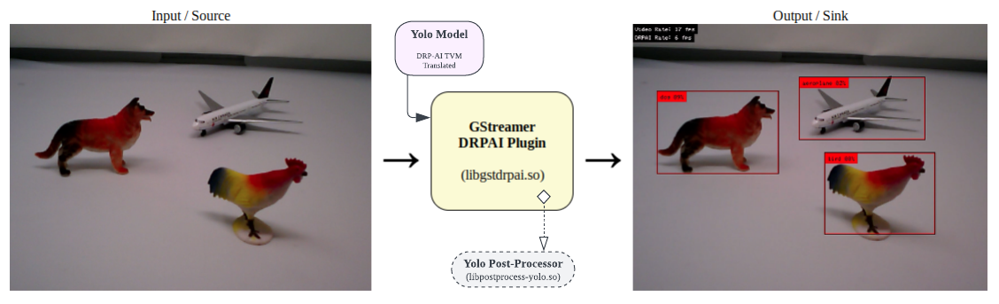

# GStreamer plugin for DRPAI

# Video Inference with DRPAI and GStreamer

MistySOM RZV2L contains the DRPAI hardware module which is able to run artificial Neural Networks 
with the focus on low power consumption. To check if this hardware module is present on your device,
you can look for both `/dev/drpai0` and `/dev/udmabuf0` devices on your linux shell. 
The Userland Direct Memory Access (UDMA) kernel module is required to provide the trained AI model and 
the input image to the DRPAI hardware. After activating the hardware, it will use the trained model to
generate the output which can be read by the UDMA module. While DRPAI is running, the running thread will
go to sleep. Of course the sleep time varies based on the size of the AI model.

MistyWest team has prepared this plugin which can receive any kind of video input,
such as a file (filesrc), a network stream (udpsrc), or a camera device (v4l2src) and outputs a video 
with bounding boxes on inferred objects using the DRPAI. Later, this video can be linked to any kind of 
output, such as the display (autovideosink), a network stream (udpsink), or a file (filesink).



**Note:** At this moment, the plugin is hardcoded to YOLOV2l model. Therefore, you need to have a copy
of the trained model ([link](models/yolov2))
with the directory name of `yolov2` inside your working directory for the plugin to work.

The plugin uses the following pad template capabilities for both **src** and **sink** which requires you
to prepare before your DRPAI element (for example, using a `videoconvert` element):

```
video/x-raw
    width: 640
    height: 480
    format: BGR
```

The plugin also provides you with the following parameters:

| Name                  | Type                | Default | Description                                                          |
|-----------------------|---------------------|--------:|----------------------------------------------------------------------|
| **multithread**       | Boolean             |    true | Use a separate thread for object detection.                          |
| **log-detects**       | Boolean             |   false | Print detected objects in standard output.                           |
| **show-fps**          | Boolean             |   false | Render frame rates of video and DRPAI at the corner of the video.    |
| **stop-error**        | Boolean             |    true | Stop the gstreamer if kernel modules fail to open.                   |
| **max-video-rate**    | Float [0.001 - 120] |     120 | Force maximum video frame rate using thread sleeps.                  |
| **max-drpai-rate**    | Float [0 - 120]     |     120 | Force maximum DRPAI frame rate using thread sleeps.                  |
| **smooth-video-rate** | Float [1 - 1000]    |       1 | Number of last video frame rates to average for a more smooth value. |
| **smooth-drpai-rate** | Float [1 - 1000]    |       1 | Number of last DRPAI frame rates to average for a more smooth value. |

## How to Build

Configure and build the repository (the sample application and DRPAI plugin) as such:

    meson setup builddir
    ninja -C builddir

See <https://mesonbuild.com/Quick-guide.html> on how to install the Meson
build system and ninja.

Once the plugin is built you can either install system-wide it with `sudo ninja
-C builddir install` (if it wouldn't be picked up by GStreamer, 
you would need to set the `GST_PLUGIN_PATH` environment variable to include or
point to `/usr/lib64/gstreamer-1.0/` for your plugin to be found by a
from-package `GStreamer`).

Alternatively, you will find your plugin binary in `builddir/gst-plugins/src/`
as `libgstdrpai.so` or similar (the extension may vary), so you can also set
the `GST_PLUGIN_PATH` environment variable to the `builddir/gst-plugins/src/`
directory (best to specify an absolute path though).

You can also check if it has been built correctly with:

    gst-inspect-1.0 builddir/gst-plugins/src/libgstdrpai.so

## Some examples of running the plugin

### Read Camera and Show on Screen

```
gst-launch-1.0 v4l2src device=/dev/video0 \
    ! videoconvert \
    ! drpai show-fps=true log-detects=true smooth-video-rate=30 \
    ! videoconvert \
    ! autovideosink
```
If your camera supports the BGR format (such as the coral camera), you can modify the camera size in 
`~/v4l2init.sh` and skip the first `videoconvert` element like this:
```
gst-launch-1.0 v4l2src device=/dev/video0 ! video/x-raw, width=640, height=480, format=BGR \
    ! drpai show-fps=true log-detects=true smooth-video-rate=30 \
    ! videoconvert \
    ! autovideosink
```
### Read Camera and Stream on Network

In case you already have the streaming working based on [here](StreamingVideo.md), you can 
add the drpai element to the `stream.sh` file like this:

````
#!/bin/bash
[ $1 ] || { echo  "Please specify the destination IP address: ./stream.sh ip" >&2; exit 1; }

./v4l2-init.sh
echo "Streaming to ${1} with DRPAI..."

gst-launch-1.0 v4l2src device=/dev/video0 ! video/x-raw, width=640, height=480, format=BGR \
    ! drpai show-fps=true log-detects=true smooth-video-rate=30 \
    ! vspmfilter dmabuf-use=true ! video/x-raw, format=NV12 \
    ! omxh264enc control-rate=2 target-bitrate=10485760 interval_intraframes=14 periodicty-idr=2 \
    ! video/x-h264,profile=\(string\)high,level=\(string\)4.2 \
    ! rtph264pay ! udpsink host=$1 port=51372
````
